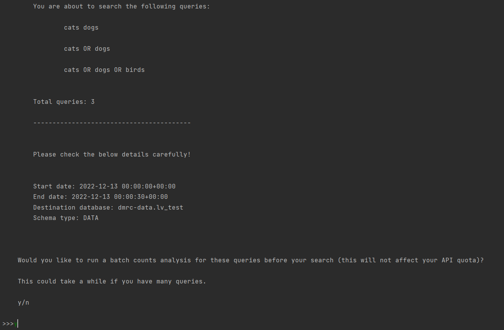

# DMRC Academic Twitter Archive Collector

 

### Overview

------------------------------------
The <b>DMRC Academic Twitter Archive (DATA)</b> Collector uses the [Twarc Python library](https://twarc-project.readthedocs.io/en/latest/twarc2_en_us/) to collect tweets from Twitter's archive, via the API 2.0 for academic research. It then processes the collected .json files and pushes the data to a designated Google BigQuery database.
Tweets can be collected from as far back as 22 Mar, 2006. 

This tool can also be used to append archive data to an existing <b>TCAT</b> or <b>TweetQuery</b> dataset, and can serve as a backfill tool to supplement previously-collected datasets.

You can now also upload a previously collected Twitter API 2.0 json file (e.g. from [Twitter's Tweet Downloader](https://developer.twitter.com/apitools/downloader)) to be processed and pushed to Google BigQuery * . 

 
 
 

### Who is this for?

------------------------------------
This tool is intended for researchers who wish to collect data from the Twitter archive (more than one week in the past), and have these data processed and pushed automatically to Google BigQuery. It was designed with DMRC researchers in mind, but may be useful to researchers from other institutions.

 
 
 

### What You Will Need

------------------------------------
1. [Python 3.8 to 3.10](https://www.python.org ) (if using a work or university PC, ensure you comply with the organisation's installation guidelines)
2. A valid [Twitter Academic API bearer token](https://developer.twitter.com/en/products/twitter-api/academic-research)
3. A valid [Google service account and json key](https://github.com/qut-dmrc/DMRC_Academic_Twitter_Archive_Collector/blob/main/how_to_set_up_google_service_account.md)
4. `xGB` free on your local drive for json file storage (the following are estimates and may differ depending on the data collected; you can store these files elsewhere after collection; see <b>Managing Disk Space</b>, below):
      
| n Tweets   | Size (GB) |
|------------|-----------|
| 250,000    | ~ 1.25    |
| 500,000    | 2 - 2.5   |
| 1,000,000  | 4 - 5     |
| 5,000,000  | 16 - 18   |
| 10,000,000 | 30 - 35   |

 
 
 

### To Use

------------------------------------

#### If you HAVEN'T already cloned this repository:
   

#### `In cmd/terminal:`

1. Navigate to a location with enough space to download tweets (refer to <b>What You Will Need</b> section, above) and create a new folder: `mkdir DMRC_DATA`.
2. Navigate into your new directory (`cd DMRC_DATA`) and create your virtual environment: `python -m venv DATA_env`.
3. Activate your virtual environment: `cd DATA_env/Scripts`, then `activate`. You should now see (DATA_env) before your path.
4. Navigate up two levels: `cd ..`, followed by `cd ..`. You should now be in the directory you created in step 1.

5. Clone this repository: `git clone https://github.com/qut-dmrc/DMRC_Academic_Twitter_Archive_Collector.git`.
    <b>ALTERNATIVELY</b>: Click the green 'Code' button at the top left of the [repository](https://github.com/qut-dmrc/DMRC_Academic_Twitter_Archive_Collector) pane, select 'Download ZIP' and extract the contents to your new DMRC_DATA directory. Navigate into the cloned directory: `cd DMRC_Academic_Twitter_Archive_Collector`.
####
6. Install venv requirements: `python -m pip install -r requirements.txt`.
####
7. Navigate to the collector: `cd DATA_collector`.
####
   

#### `In your file explorer:`
8. Navigate to the `DATA_collector` directory (e.g. `C:/Users/You/Desktop/DMRC_Academic_Twitter_Archive_Collector/DATA_collector`).
####
9. Place your Google BigQuery service key json file into the `DATA_collector/access_key` directory.
####
10. Open `DATA_collector/config/config_template.yml`.
      1. Set your query parameters:
         * <b>query:</b> 
           * EITHER a string containing keyword(s) and/or phrase(s) up to 1024 characters each, e.g. `'cats OR kittens'` 
           * OR a list of search strings (up to 1024 characters each) e.g. `['cats OR kittens', 'dogs OR puppies', 'birds chicks from:albomp']`

         * <b>start_date:</b> the earliest date to search, in UTC time.
         * <b>end_date:</b> the latest date to search, in UTC time.
      ####
      2. Enter your bearer token:
         * <b>bearer_token</b>: your Twitter Academic API bearer token.
      ####
      3. Set your Google BigQuery project and dataset:
         * <b>project_id:</b> name of the relevant Google BigQuery billing project. Must match the provided service account key.
         * <b>dataset:</b> the name of your intended dataset, e.g. `'twitter_pets_2022'`. <b>IMPORTANT</b>: If the dataset already exists, the data will be appended to the existing dataset; if it does not exist, a new dataset will be created.
      ####
      4. Choose your <b>schema type</b> (DATA, TCAT, TweetQuery). `DATA = True` by default. Refer to <b>Output</b>, below, for schema details.
####
11. Rename `config_template.yml` to `config.yml`.
####
   

#### `In cmd/terminal:` 
12. Run `python ./run.py`.
###
####
After you run `run.py`, you will be prompted to verify your query config details. If everything is correct, type `y`, otherwise, type `n` to exit and change your input.
 
 
 
#### !!! If you HAVE already cloned this repository:
There is a very good chance that (beneficial!) changes have been made to this repository. Remember to update before you use DATA using 
`git pull origin main`!

 
 
 

### Running DATA

------------------------------------
When you run DATA, you will be asked to select one of two options:

#### <u>If you select option 1</u>:
If your query is a string (i.e. `cats dogs`), DATA will automatically get the counts for your query and ask you if you would like to proceed with your search: 
 
 

 
 
If your query is a list of strings, i.e. `['cats dogs', 'cats OR dogs', 'cats OR dogs OR birds']`, you will be asked if you would like to check the volume of each query. If you select 'y', a .csv file will be written to your directory containing the counts for each query. If you select 'n', you will be asked if you would like to commence your search without running the counts first (i.e. if you already have the counts).
 
 

 

#### <u>If you select option 2</u>:

Option 2 allows the user to process tweets collected using Twarc2, provided the data were collected from the archive endpoint. Additionally, a file collected using DATA (and located in the `my_collections/your_directory/collected_json` directory) can be moved into `DATA_collector/json_input_files` and reprocessed. Files from [Twitter's Tweet Downloader](https://developer.twitter.com/apitools/downloader) can be similarly processed from this directory, but this function is in testing. Refer to <b>Uploading a .json file to be processed</b> section, below.
 
 
 
 
 
### Output

------------------------------------
Depending on the schema type selected, the tool will produce data as shown below:

| Schema Type | Purpose                                                                                                | n Tables | Table Names                                                                                                                                                                                                                           |
|-------------|--------------------------------------------------------------------------------------------------------|----------|---------------------------------------------------------------------------------------------------------------------------------------------------------------------------------------------------------------------------------------|
| DATA        | Standalone archive data analysis, where it is not necessary to append archive data to existing tables. | 13       | annotations author_description author_urls context_annotations hashtags cashtags interactions media mentions poll_options tweets urls edit_history (for tweets later than August 2022) |
| TCAT        | Backfill/append archive data to an existing TCAT table                                                 | 3        | hashtags mentions tweets                                                                                                                                                                                                      |
| TweetQuery  | Backfill/append archive data to an existing TweetQuery table                                           | 1        | tweets_flat                                                                                                                                                                                                                           |

A detailed overview of the tables and fields is located [here](https://github.com/qut-dmrc/DMRC_Academic_Twitter_Archive_Collector/tree/main/supp_docs).
 

 
 
 

### How to Build a Query

------------------------------------
####
#### Query string
Your query string should follow Twitter's rules for [How to Build a Query](https://developer.twitter.com/en/docs/twitter-api/tweets/search/integrate/build-a-query#build).
####
Queries may be up to 1024 characters long.
####
Queries are case insensitive.

 

#### Operator logic

| Operator    | Logic    | Example                          | What it does                                                                 |
|-------------|----------|----------------------------------|------------------------------------------------------------------------------|
|   | AND      | cats kittens                     | searches for tweets that contain keywords 'cats' AND 'kittens'               |
| OR          | OR       | cats OR kittens                  | searches for tweets that contain keywords 'cats' OR 'kittens'                |
| -           | NOT      | cats -kittens                    | searches for tweets that contain keywords 'cats', but NOT 'kittens'          |
| (&nbsp;&nbsp;) | Grouping | (cats OR kittens) (dogs puppies) | searches for tweets that contain keywords 'cats' or 'kittens' AND 'dogs' AND 'puppies' |  
| " "       | Exact string | "cats are cute"                  | searches for the exact string as a keyword, e.g. "cats are cute"             |

 

#### Order of operations
AND operators are evaluated before OR operators. For example, 'cats OR dogs puppies' will be evaluated as 'cats OR (dogs AND puppies)'.
####
 
 
 

### Tweet reference levels

------------------------------
The DATA tool collects Twitter data using the <b>Twarc2</b> library. During processing, it generates several extra fields to enrich these data. One such field is called <b>'reference_level'</b>.

Tweets that match the search parameters are situated at reference_level 0. 
If any tweets at reference level 0 happen to reference another tweet in any way (i.e. retweet, quote, reply), then that referenced tweet will be situated at reference_level 1, and so on. 
Unless you are interested in these referenced tweets, it can be useful to filter the data to include Tweets where reference_level=0 at the time of analysis. This focuses your analysis on tweets that directly match your search parameters, 
and reduces the size of your working dataset.

 
 
 

### Uploading a .json file to be processed

------------------------------------
If you have a .json file from Twitter's Tweet Downloader, you can have this processed and pushed to a Google BigQuery dataset by following these steps:

`TBC` '* Load from 'Tweet Collector' json currently in testing phase.

 
 
 

### Managing disk space

------------------------------------
####
This tool is designed to run on a user's local computer. In order to keep collected file sizes manageable, collections are split into files containing (on average) 100,000 tweets. This means that for collections greater than this, files will average approximately 1GB in size.
If you need to clear some space on your hard drive, you can remove collected .json files from the `DATA_Collector/my_collections/your_directory/collected_json folder` while the collector is running, and move them to a backup location.

If you do remove files from this location, and need to stop/restart the collector, <b>you will need to update the start_date parameter in `config.yml` to avoid re-collecting those files</b>. 
Be sure not to remove the current collection file (the newest file in the directory).
####
 
 
 

### Logging

------------------------------------
####
A timestamped log file will be generated at location `DATA_collector/logging` each time you run a collection.
This log file contains all outputs and can aid in investigating any errors that may arise.
####
 
 
 

### Frequently Asked Questions

------------------------------------
Refer to [FAQs](https://github.com/qut-dmrc/DMRC_Academic_Twitter_Archive_Collector/blob/main/FAQs.md)
 
 
 

### Problems?

------------------------------------
This is an ongoing development project. If you have any problems or further questions, please send an email to laura.vodden@qut.edu.au.

